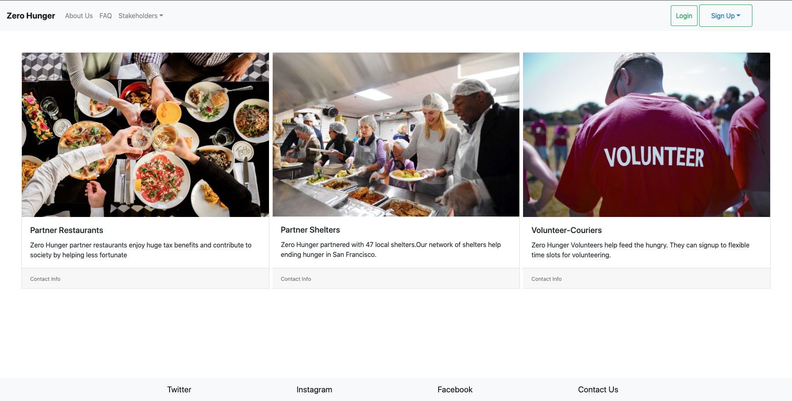

# Food Sharing Web platform

## Description

Local restaurants can donate food via the platform. Volunteer-couriers will deliver the food to local homeless shelters and other organizations that need food donations. This web app is MVP version of this idea. As of July 2020, this project is named Foodonate, a non-profit at a startup stage. [See this repo](https://github.com/makhmudislamov/foodonate_demo/blob/master/README.md) for updated version of this project.

## How to run this project in your machine
1. Download this repo
2. Install dependencies `npm install`
3. Go to FRONT-END folder (see Front End section below)
4. Go to BACK-END folder (see Back End section below)

### Front End
This project was bootstrapped with [Create React App](https://github.com/facebook/create-react-app).

#### Available Scripts

In the FRONT-END directory, you can run:

#### `npm install` - to install dependencies
#### `yarn start` or `npm start`

Runs the app in the development mode. 
Open [http://localhost:3000](http://localhost:3000) to view it in the browser.

The page will reload if you make edits. 

### Back End

Back end is built with Node.js, Express.js

#### Available Scripts

In the BACK-END directory, you can run:

#### `npm install` - to install dependencies
#### `nodemon` - to start back end
The back end will reload if you make edits.

### DevOps

Error logging is done via [Sentry](https://sentry.io/welcome/)